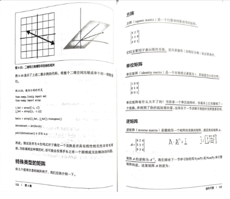

# essential-math-for-data-science
数据科学的数学基础

# 代码实现

| 章节   | 章节名称                                                     | 是否完成 | 补充学习内容                                                 |
| ------ | ------------------------------------------------------------ | -------- | ------------------------------------------------------------ |
| 第一章 | [基本的数学和微积分回顾](https://github.com/YeJiu97/essential-math-for-data-science/tree/main/src/chapter01) | 是       | [微积分](https://www.bilibili.com/video/BV1qW411N7FU/?spm_id_from=333.337.search-card.all.click&vd_source=70cc82c6f851aaa826e5c863112d2113) |
| 第二章 | [概率论](https://github.com/YeJiu97/essential-math-for-data-science/tree/main/src/chapter02) | 是       | [贝叶斯](https://www.bilibili.com/video/BV1R7411a76r/?spm_id_from=333.337.search-card.all.click) |
| 第三章 | [描述统计和推理统计学](https://github.com/YeJiu97/essential-math-for-data-science/tree/main/src/chapter03) | 是       | [$R^2$](https://www.bilibili.com/video/BV1bM41167z8/?spm_id_from=333.337.search-card.all.click&vd_source=70cc82c6f851aaa826e5c863112d2113) |
| 第四章 | [线性代数](https://github.com/YeJiu97/essential-math-for-data-science/tree/main/src/chapter04) | 是       | [线性代数](https://www.bilibili.com/video/BV1ib411t7YR/?spm_id_from=333.337.search-card.all.click) |
| 第五章 | [线性回归](https://github.com/YeJiu97/essential-math-for-data-science/tree/main/src/chapter05) | 是       | [梯度下降](https://www.bilibili.com/video/BV18P4y1j7uH/?spm_id_from=333.337.search-card.all.click) |
| 第六章 | [逻辑斯蒂回归与分类](https://github.com/YeJiu97/essential-math-for-data-science/tree/main/src/chapter06) | 是       | [混淆矩阵](https://www.bilibili.com/video/BV1oz4y1R71a/?spm_id_from=333.337.search-card.all.click)，[ROC-AUC](https://www.bilibili.com/video/BV1wz4y197LU/?spm_id_from=333.337.search-card.all.click)，[曲线关系](https://www.bilibili.com/video/BV1pg4y1i7CN/?vd_source=70cc82c6f851aaa826e5c863112d2113)，[曲线场景](https://www.bilibili.com/video/BV1sQ4y1P7ax/?vd_source=70cc82c6f851aaa826e5c863112d2113) |
| 第七章 | [神经网络](https://github.com/YeJiu97/essential-math-for-data-science/tree/main/src/chapter07) | 是       | 建议观看：3B1B的 [神经网络系列视频](https://space.bilibili.com/88461692/channel/seriesdetail?sid=1528929)，鱼书更好一些 |

# 书籍评价

书籍评价：⭐⭐⭐⭐/⭐⭐⭐⭐⭐。

感觉排版不够紧凑，但是也没有能够想出有什么更好的排版，或许可以参考一下Manning出版的那些书籍，这个Oreilly的书籍基本上都是这样的。

另外书籍里面有一些错误的排版，比如说某一行的缩进是错误的，这样的错误很低级（注：注意到是直接从英文的pdf上复制黏贴产生的结果）。

内容总体上来的是偏向于入门的，但是感觉讲解的不够详细，我认为应该可以结合更多的例子进行详解的讲解定理的使用，每个章节之后的习题，在涉及到概率统计的章节和线性回归的章节，最好也是给出一个具体的例子，然后让读者从这些例子去做这一章学习到的内容，而不是单纯的让读者去计算或者用代码计算。

关于公式的推到很多时候是不存在的，比如说第五章的线性回归的封闭矩阵是怎么回事，QR分解如何推到，也是不存在的，如果是这样，在使用的时候先生成一个例子进行可视化或者公式展开进行讲解，会是一个更好的选择。

总体上来讲一般，但是更多的是起到了对数据科学所需的数学只是的总览的作用，如果想要非常坚实的打下基础，那么需要的是找对应章节的知识点的教材来进行更加的系统性的学习。

标价118，入手肯定是有问题的，拼多多上面买了将近80，不划算，入手在60的话还可以，不然还是算了。
